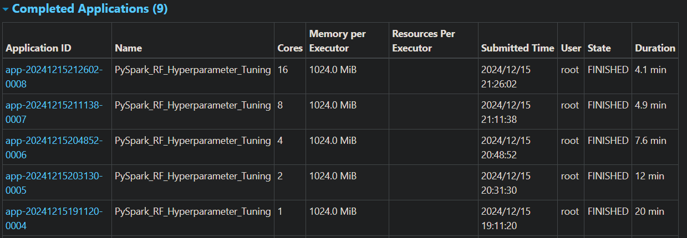
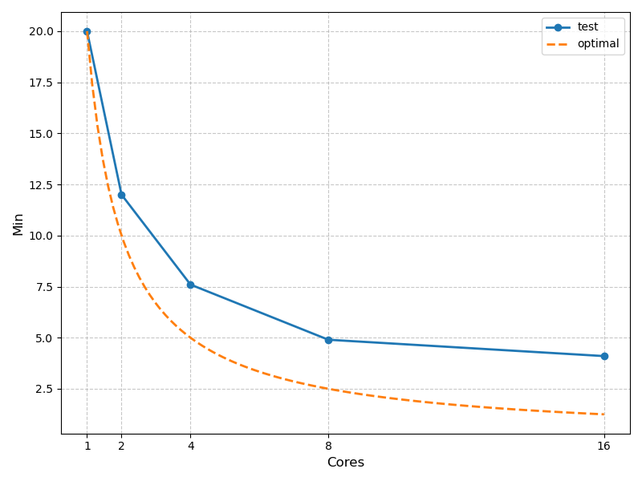
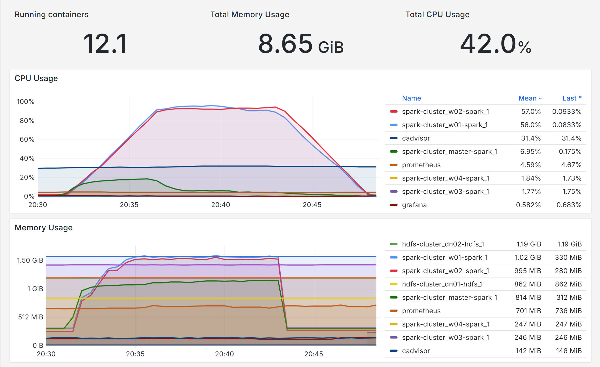
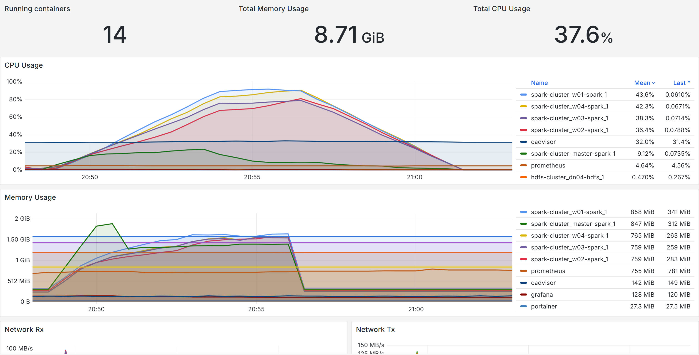
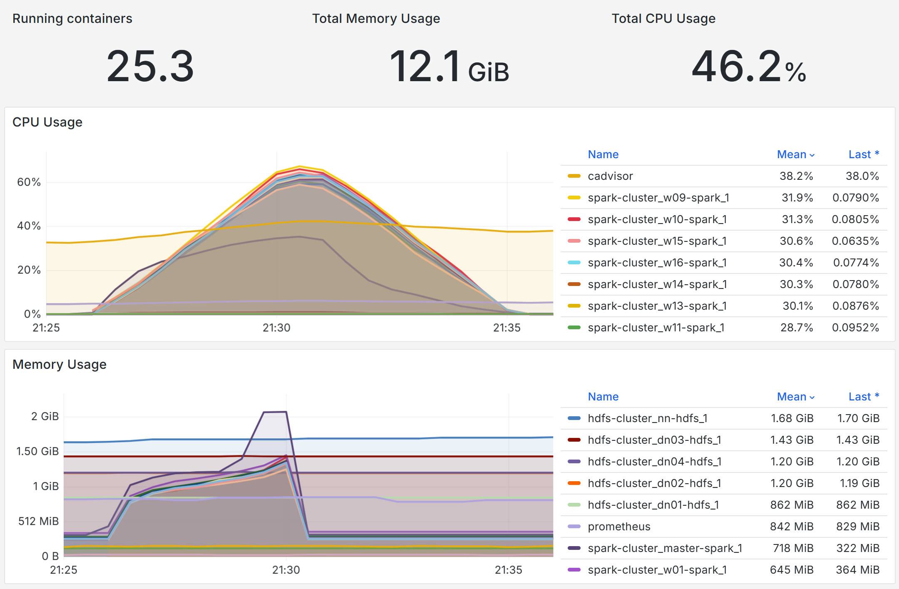
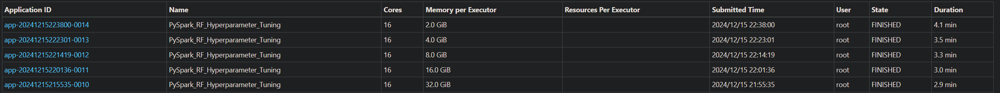
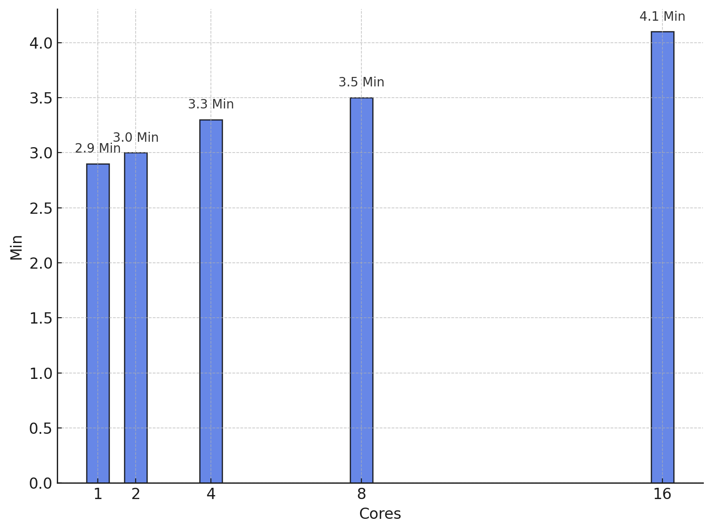
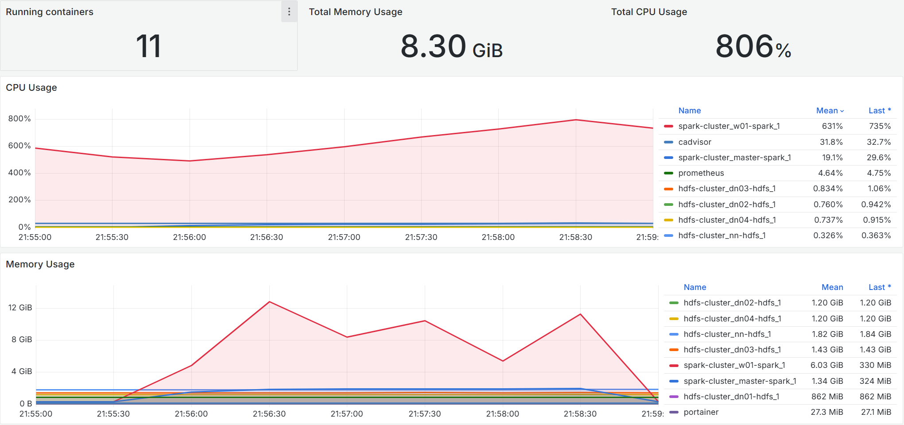
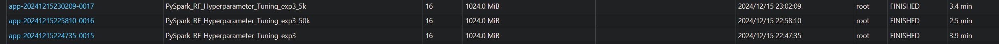
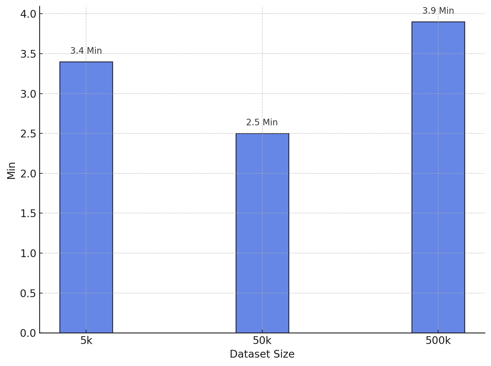

# ECNU-DistSys-Final-2024
**大规模数据处理系统 - 期末小组作业**

主题: **对 Spark 的可扩展性的实验探究**

## 实验设计
### 实验负载
随机森林训练，约 500k 行，CPU密集型任务。
负载以 Client 模式运行在 Spark Master 容器中。

### 采集数据
1. 通过 cAdvisor + Prometheus + Grafana 监控 docker 的各项资源占用，主要监控网络占用和CPU占用，可以自动绘制图表。
2. 实验代码中最后输出总训练时长; Spark UI 中也可以看到。手动导入数据用 python 脚本绘制折线图。

### 1. 固定 worker 配置，调整 worker 的数量

#### 参数
将每个 worker 配置成 1 核心, 1 GB 内存。

并行度倍率：总核数的 3 倍(spark.default.parallelism = 3 × 核数)。 

分别测试 1, 2, 4, 8, 16 个 worker 下的表现。

#### 预期结果
理想情况下，每一份 worker 都能把自身资源完整利用上，执行速度随 worker 数量线性增长，则执行时间随 worker 数量的增长反比例下降。但考虑到调度开销、任务启动开销等由 Spark 框架带来的不可避免的开销，实际情况肯定不会这么完美，只能是接近，执行时间会比预期要长一些。

### 2. 固定资源池，在相同负载下逐渐增加 worker 数量

#### 参数
总资源池配置成 16 核心 32 GB 内存。

并行度倍率：总核数的 3 倍(spark.default.parallelism = 3 × 核数), 此处即固定为 48 并行度。 

| worker 数量 | 每 worker 核心数 | 每 worker 内存数 |
|:-|-|-|
| 1  | 16 | 32 |
| 2  | 8  | 16 |
| 4  | 4  | 8  |
| 8  | 2  | 4  |
| 16 | 1  | 2  |

#### 预期结果
虽然总的核心和内存数量不变，但是考虑到 Spark 的调度开销，执行时间应会随着 worker 数量的增加而增加，但并不明显，应能表明 Spark 的设计比较优良。

这次实验中也包含了一个单机 16 核心 32GB 内存的情况，相比前一次实验的 16 workers 的情况，其执行时间应该更短，也能表明 Spark 对纵向扩展的支持非常好。

### 3. 固定 worker 数量，调整数据集大小

#### 参数
使用 16 个 1 核心 1GB 内存的 worker。

测试 3 种数据集，行数分别为 5k 行, 50k 行, 500k 行。

并行度倍率：总核数的 3 倍(spark.default.parallelism = 3 × 核数), 此处即固定为 48 并行度。 

#### 预期结果

理想情况中，随着数据集的明显增大，训练时间也应明显增大。但是由于我们的数据量比较小，实际上可能算不上 CPU 密集型的任务，反而成为 IO 密集型。实际的训练时间变长的幅度远达不到数据集这种10倍的增长幅度。在数据集过小的情况下，各个 worker 的利用率应该都比较低，任务常被 Master 拖累。

## 实验结果及分析

### 1. 固定 worker 配置，调整 worker 的数量

我们使用 CPU 密集型的任务进行测试，由于 Spark 的设计，我们得到了"执行时间随 worker 数量的增加而近似反比例降低" 的结果。首先这能够体现 Spark 对于横向扩展的良好支持。但是, 随着 worker 数量的增加，调度和通信的开销明显增大，计算时间的占比明显降低, 性能提升受到限制。虽然 16 worker 比 8 worker 的执行时间更短，但是其加速幅度已经很不明显。说明我们应该根据任务规模合理设置 worker 数量和并行度，避免资源浪费。worker 过多时应考虑系统开销是否抵消了性能收益。

我们观察 2/4/16 workers 下的 cpu 占用:

从图片中可以看出，在 2 workers 的情况下，CPU 占用的峰值可以稳定在 90% 左右，可以说此时 cpu 占用已经达到饱和了。但是在 4 workers 的情况下，4 个容器的 CPU 占用分布在 70%~90%, 已经不太饱和了。在 16 workers 的情况下，每个容器的 CPU 占用最高只有 60% 左右，CPU 资源并没有被完全利用上, 也能解释 16 workers 提升不明显的现象。

### 2. 固定资源池，在相同负载下逐渐增加 worker 数量

由图片可以看出，在总的核心和内存数量不变的情况下，执行时间随着 worker 数量的增加而增加。在从1 worker 增大到 8 worker 的过程中，我们可以认为调度开销、通信开销的增长并不明显， Spark 在对调度开销的控制上还是十分优秀的。但是在增大到 16 worker 时，执行时间明显变长。结合 1 中的分析我们可以知道，原因是我们的计算负载并不够重，数据集不够大，worker 快速完成了 master 分配的任务后便闲置下来，需要等待新的任务分配。

这次实验中也包含了一个单机 16 核心 32GB 内存的情况，执行时间很短，这表明 Spark 对纵向扩展的支持非常好。

虽然图片中 CPU 的利用率只有约800%, 但是执行时通过`htop`进行观测，大部分时候 16 核心的占用都是满的。但这也说明对纵向扩展的支持并不是完美的，纵向扩展只是免去了一部分网络开销，在多个核心上执行任务的调度也是有开销的。

### 3. 固定 worker 数量，调整数据集大小

数据集大小成十倍增长，但是实际的训练时间变长的幅度远达不到数据集这种10倍的增长幅度，这一方面符合我们的预期。在数据集过小的情况下，各节点的 CPU 利用率均非常低，甚至低于 Master 节点。

在 5k 和 50k 的情况下，各 worker 节点的利用率均只有 20% 左右，非常低，而 Master 节点的利用率都有 30%。500k 的情况下则回归到 60%。结合实验2，能够说明 worker 数量要与实际负载匹配，将小负载分散到大量 worker 中并不能带来可观的时间减小。

注意到 50k 的情况下执行时间的反常减小。这主要是由于算法原因：
+ 随机森林通过构建多棵决策树来完成训练，每棵树的分裂决策依赖于数据集特征的划分，小数据集样本少，分裂后剩余样本不足以满足停止条件，随机森林需额外尝试计算分裂，增加计算量。
+ 小数据集导致特征效果不显著，导致算法需要进行更多尝试以找到最佳分裂点

## 分工 
+ 吴清源 (25%): 实验设计、实验执行、结果分析、文档撰写
+ 周凯文 (25%): 编写pyspark代码、数据处理、数据可视化、实验结果可视化
+ 杨柳 (25%)：实验设计、镜像构建、环境的部署和测试、数据可视化、数据收集、部署文档撰写
+ 董宸廷 (25%)：实验设计、实验结果收集、PPT制作
